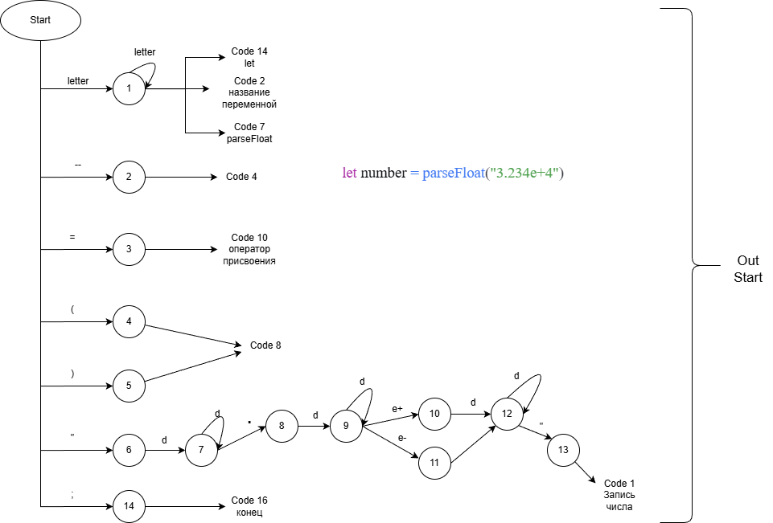
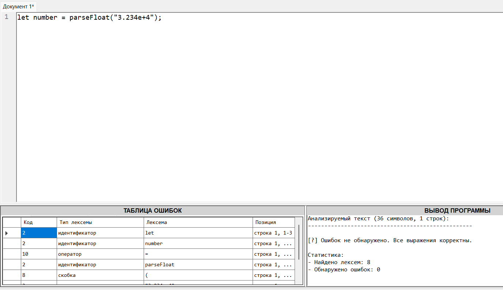
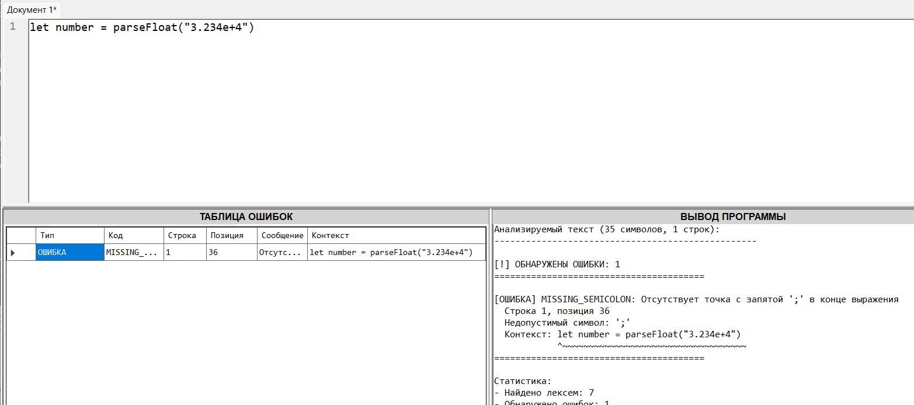
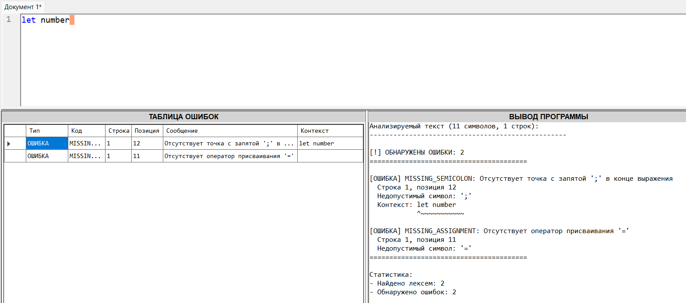
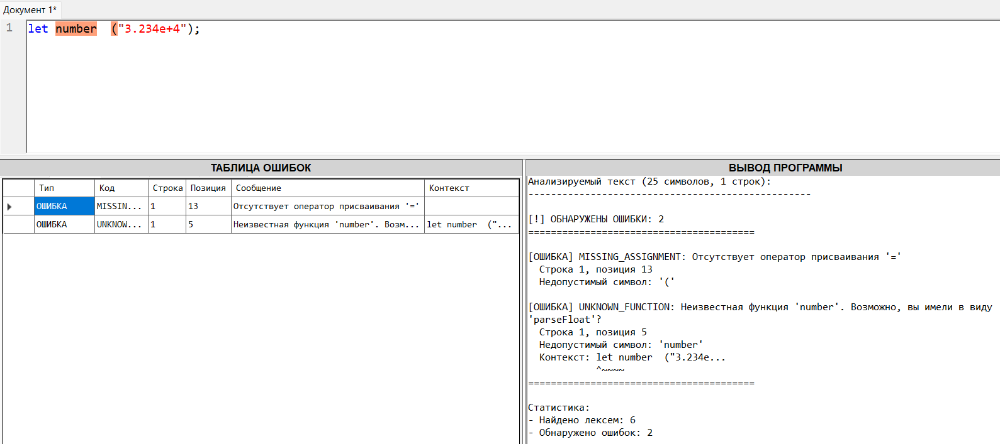
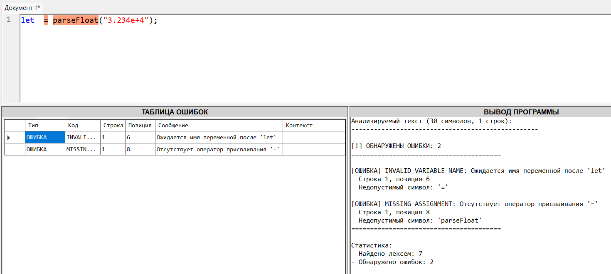
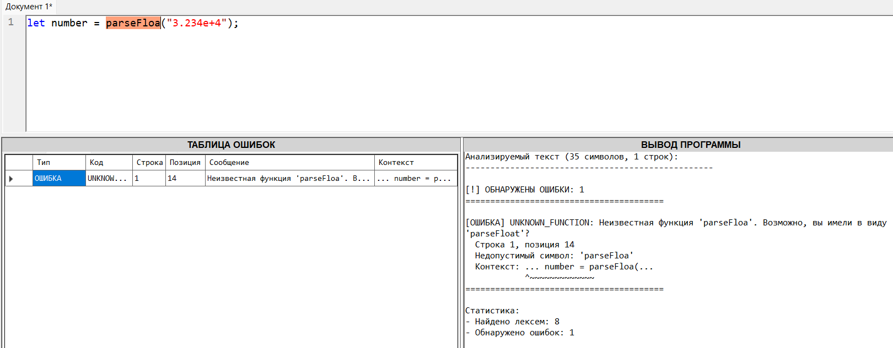
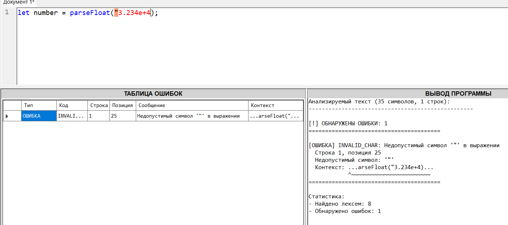
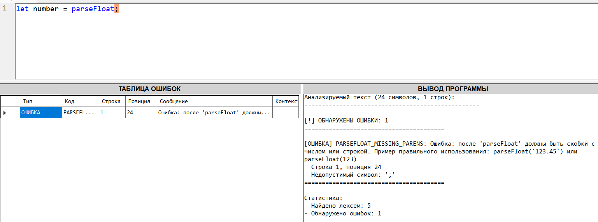

## Название и цель лабораторной работы
Название: Разработка лексического анализатора (сканера)

Цель работы: Изучить назначение и принципы работы лексического анализатора в структуре компилятора. Спроектировать алгоритм (диаграмму состояний) и выполнить программную реализацию сканера для выделения лексем из входного текста. Интегрировать разработанный модуль в ранее созданный графический интерфейс языкового процессора.

## Сведения об авторе
Студентка: Попова Дарья
Группа: АВТ-314

## Вариант 48

Парсинг научной нотации в число на языке JavaScript.
Пример - let number = parseFloat("3.234e+4");

## Диаграмма состояний

Лексический анализатор (сканер) представляет собой конечный автомат, который последовательно читает символы входной строки слева направо и на основе текущего символа определяет, к какому классу лексем он относится, формируя соответствующие токены.

Пошагово на основе моего варианта:

Шаг 1: Автомат видит букву l, начинает сбор идентификатора. Читает let — проверяет по словарю ключевых слов, находит совпадение. Создает токен "ключевое слово" (код 14).

Шаг 2: Пробел после let игнорируется.

Шаг 3: Буква n — начало нового идентификатора. Собирает number, проверяет по словарям — не ключевое слово и не функция. Создает токен "идентификатор" (код 2).

Шаг 4: Пробел игнорируется.

Шаг 5: Символ = — оператор. Проверяет, не является ли частью составного оператора (например, ==). Следующий символ — пробел, значит это одиночный оператор. Создает токен "оператор" (код 10).

Шаг 6: Пробел игнорируется.

Шаг 7: Буква p — сбор идентификатора. Читает parseFloat, проверяет по словарю функций — находит совпадение. Создает токен "функция" (код 7).

Шаг 8: Символ ( — скобка. Создает токен "скобка" (код 8).

Шаг 9: Кавычка " — начало строки. Читает все символы до закрывающей кавычки: "3.234e+4". Создает токен "строка" (код 3).

Шаг 10: Символ ) — скобка. Создает токен "скобка" (код 8).

Шаг 11: Символ ; — конец оператора. Создает токен "конец оператора" (код 16).

##Тестовые примеры:

1. Корректные данные

2. Отсутствует ;

3. Нету ничего кроме названия перенеменной и ключевого слова

4. Нету оператора присвоения

5. Нету названия переменной

6. Ошибка в parseFloat

7. Ошибка в кавычках

8. Нету числа и скобок после parseFloat

